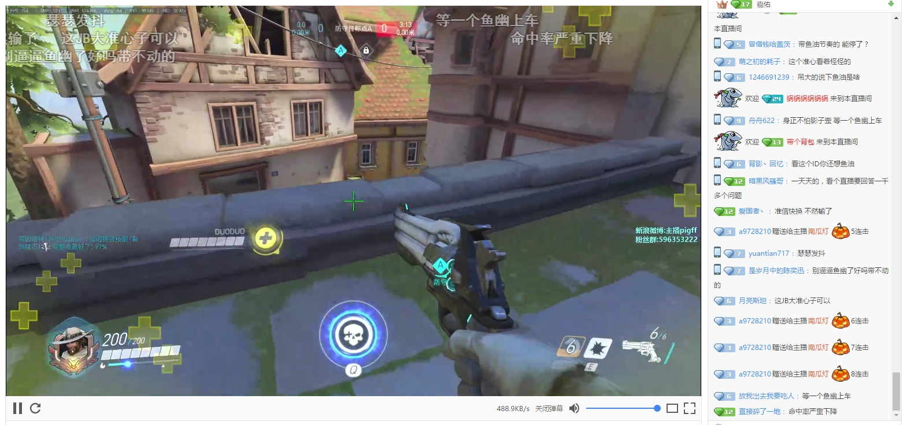

# 斗鱼HTML5播放器

**2017/7/17 更新**

因斗鱼又更新了API接口, 本程序使用的接口已暂时失效, 需要重新分析斗鱼的播放器程序(分析出新的API拿到直播地址)才能继续使用. 故暂时推一个版本禁用扩展程序, 预计两周后更新新版本.(实在逆不出来也没有办法, 最近个人原因比较没有时间)

基于 [flv.js](https://github.com/Bilibili/flv.js) 的斗鱼HTML5播放器.

使用了 flv.js 内核提供的直播流播放, 用 JavaScript 实现了斗鱼的弹幕协议, 并支持发送弹幕和送礼物.

# 使用

**不要**使用 Chrome 直接加载本文件夹, 本扩展程序需要构建后才能使用.

[Chrome 应用商店](https://chrome.google.com/webstore/detail/hbocinidadgpnbcamhjgfbgiebhpnmfj)

[Greasy Fork](https://greasyfork.org/scripts/26901) (Firefox)

要求 Chrome 版本大于等于 49 (仅在54+版本测试过)

打开斗鱼的直播间, 如果没有错误, 播放器就已经被自动替换.

注: 如开启了 [chrome://flags/#extension-active-script-permission](chrome://flags/#extension-active-script-permission), 请注意允许扩展程序在所有网址上运行, 否则会没有权限运行.

# 原理

视频播放基于 flv.js, 弹幕发射使用 CSS3, 弹幕协议通过自制一个很小的 Flash 与 JavaScript 通信, 在 JavaScript 中实现斗鱼的弹幕协议.

由于斗鱼使用了 HTTPS, 受到 Mixed Content 限制, 只能在 Background 页面 fetch 视频内容再传到 Content Script 给 flv.js 进行播放.

具体原理请见我的 [blog](http://blog.imspace.cn/2016/10/29/DouyuHTML5Player/)

# 构建

1. `npm install`

2. `npm run build`

3. `npm run pack` 在 versions 文件夹查看 zip 文件
